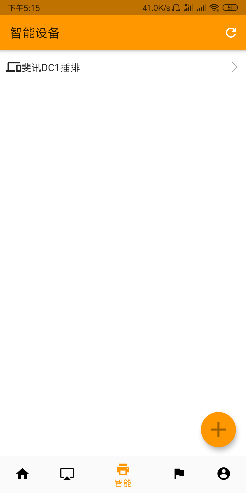
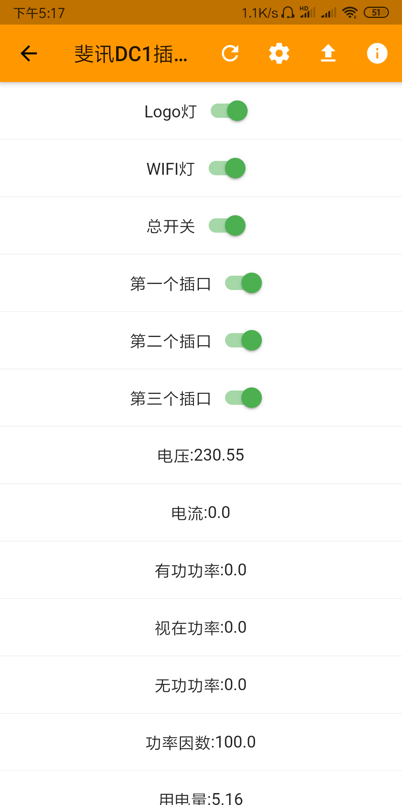
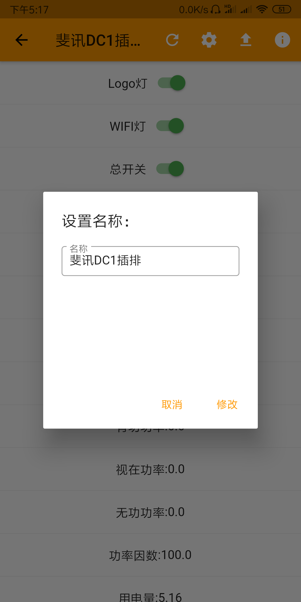
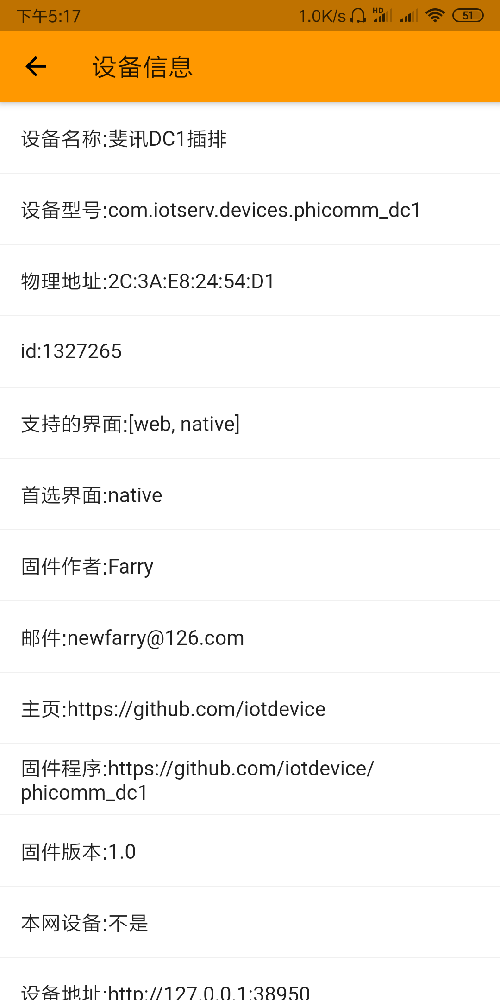

# phicomm_dc1

* 斐讯插排交流QQ群：251227638（验证：斐讯）  

斐讯插排DC1第三方开源固件

如果你需要斐讯TC1 a1插排的远程控制，请看：[TC1](https://github.com/IoTDevice/phicomm_tc1_a1)
## WHY
众所周知的原因，斐讯服务器已经不能正常访问，插座的APP控制已经无法正常实现，需要有另外的方式实现插座的控制。根据[Samuel-0-0](https://github.com/Samuel-0-0/phicomm_dc1-esphome)开源的硬件文档开发
## 特色 
固件里面不包含固定的wifi信息，使用[开源APP](https://github.com/OpenIoTHub/OpenIoTHub)实现配网，设备发现，局域网控制及远程控制的功能 
## 项目进度 
当前支持获取电力统计信息，局域网和远程APP控制，插排上的实体按键还未去实现，所以所有操作只能通过app进行 
## 插排挂件程序下载 
https://github.com/iotdevice/phicomm_dc1/releases
## 刷机方法
可以参照[Samuel-0-0的刷机文档](https://github.com/Samuel-0-0/phicomm_dc1-esphome/tree/master/cookbook)
## 手机APP 
- app下载地址：https://github.com/OpenIoTHub/OpenIoTHub/releases (安装好此程序就可以给刷好本固件程序的设备配网并发现控制了，如果想外网访问请使用下面的软件)
- 如果你想外网访问请安装此软件配套的网关，地址：https://github.com/OpenIoTHub/GateWay/releases
- 程序安装和使用参考：https://www.jianshu.com/p/112c1583889f
### app操作界面 

## 致谢
以下排名不分先后，为随机。
- [Samuel-0-0](https://github.com/Samuel-0-0/phicomm_dc1-esphome)：硬件信息的详细文档
- killadm：  导出原始固件，提供WiFi芯片对比图，主控制板WiFi模块、U7移除后的PCB照片，U7逻辑分析数据采集
- 老妖：U7驱动编写，U7逻辑分析
- 实验幼儿园小二班扛把子：  测试引脚走向
- Heller、巴山耗子： 初期资料整理
- 风中的summer： 提供清晰的电路板照片，拆机过程照片
